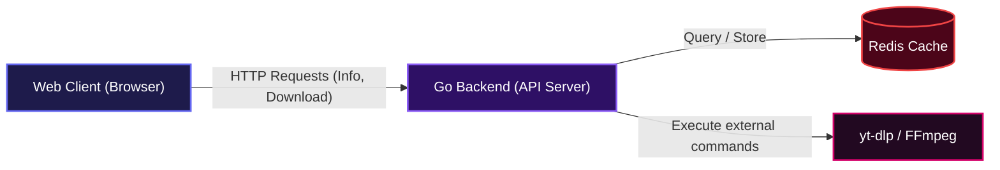

# SaveIt: Universal Video Downloader


This project gives you a super easy way to download videos from tons of websites. You just paste a video link, and it handles all the heavy lifting of finding the right video formats and letting you download them directly. No complicated software to install on your computer, just a simple web interface that gets the job done.

## Installation

To get SaveIt up and running on your local machine, follow these steps.

### Clone the Repository

First, grab a copy of the project:

```bash
git clone https://github.com/samueltuoyo15/SaveIt.git
cd SaveIt
```

### With Docker Compose (Recommended)

This is the easiest way to run SaveIt, as it handles all dependencies like Redis and `yt-dlp`.

```bash
docker compose up --build -d
```

Once the containers are running, you can access the application in your browser at `http://localhost:5000`.

### Without Docker

If you prefer to run it directly, you'll need Go 1.24+, `yt-dlp`, `ffmpeg`, and a running Redis instance installed on your system.

1.  **Install Dependencies**: Ensure you have Go 1.24+, `yt-dlp`, and `ffmpeg` installed.
2.  **Start Redis**: Make sure your Redis server is running.
3.  **Run the application**:
    ```bash
    go run ./cmd/server/main.go
    ```

The application will then be available on `http://localhost:5000`.

## Usage

Using SaveIt is straightforward:

1.  **Paste your video URL**: Just copy a link from any of the supported platforms (YouTube, TikTok, Instagram, etc.) and paste it into the input field on the homepage.
2.  **Get Formats**: Click the 'Get Formats' button. The app will fetch the video details and available download qualities.
3.  **Select Quality**: Choose your preferred video or audio quality from the options presented.
4.  **Download**: Click the 'Download' button, and the video will start downloading directly to your device.

## Features

*   **Wide Platform Support**: SaveIt can download videos from over 1000 platforms, including popular sites like YouTube, TikTok, Instagram, Twitter, Reddit, and Twitch, by leveraging the power of `yt-dlp`.
*   **Video Format Selection**: After pasting a URL, the application quickly presents you with various video and audio quality options, allowing you to choose the exact format you need.
    ```mermaid
    sequenceDiagram
      actor User
      participant WebClient as "Web Client"
      participant GoBackend as "Go Backend (API)"
      participant YTDLP as "yt-dlp Process"
      participant RedisCache as "Redis Cache"

      User->>WebClient: Pastes video URL
      WebClient->>GoBackend: POST /api/info (URL)
      GoBackend->>RedisCache: Check cache for video info
      alt Cache Hit
        RedisCache-->>GoBackend: Cached info
        GoBackend-->>WebClient: Video Info (from cache)
      else Cache Miss
        RedisCache-->>GoBackend: No cached info
        GoBackend->>YTDLP: Fetch video metadata
        YTDLP-->>GoBackend: Raw metadata (JSON)
        GoBackend->>GoBackend: Parse and format info
        GoBackend->>RedisCache: Store formatted info
        RedisCache-->>GoBackend: Acknowledged
        GoBackend-->>WebClient: Formatted video info
      end
      WebClient->>User: Displays video details & formats
    ```
*   **Fast Metadata Fetching**: To ensure a speedy experience, SaveIt uses Redis to cache video metadata. This means if someone has recently looked up a video, the information appears almost instantly for subsequent requests.
*   **Direct Download Streaming**: Once you select your desired format, SaveIt streams the video content directly to your browser for download, without storing the full video on its server.
    ```mermaid
    sequenceDiagram
      actor User
      participant WebClient as "Web Client"
      participant GoBackend as "Go Backend (API)"
      participant YTDLP as "yt-dlp Process"

      User->>WebClient: Selects format & clicks Download
      WebClient->>GoBackend: GET /download (URL, format ID)
      GoBackend->>YTDLP: Stream video with format ID
      YTDLP-->>GoBackend: Stream video chunks
      GoBackend-->>WebClient: Stream video chunks
      WebClient->>User: Downloads video file
    ```
*   **Containerized Deployment**: With Docker and Docker Compose, setting up SaveIt is a breeze. It creates an isolated environment, making deployment simple and consistent across different systems.

## System Architecture / Design

SaveIt employs a straightforward client-server architecture, powered by Go and leveraging external tools for media processing, with Redis for efficient caching.



## Technologies Used

| Technology         | Description                                     |
| :----------------- | :---------------------------------------------- |
| **Go**             | Powers the fast and concurrent backend API.     |
| **yt-dlp**         | Handles robust video metadata extraction and streaming. |
| **FFmpeg**         | Used by `yt-dlp` for video format merging and processing. |
| **Redis**          | Provides high-performance caching for video metadata. |
| **Docker**         | Containerizes the application for easy deployment. |
| **Docker Compose** | Orchestrates multi-container setup with Redis.   |
| **Vanilla JS**     | Drives the simple and responsive frontend interface. |

## API Documentation

SaveIt exposes two main API endpoints for fetching video information and initiating downloads.

#### POST /api/info

**Description**: Fetches detailed metadata for a given video URL, including available formats and their properties. Responses are cached for faster retrieval.

**Request**:
```json
{
  "url": "https://www.youtube.com/watch?v=dQw4w9WgXcQ"
}
```

**Response**:
```json
{
  "id": "dQw4w9WgXcQ",
  "title": "Rick Astley - Never Gonna Give You Up (Official Music Video)",
  "author": "RickAstley",
  "thumbnail": "https://i.ytimg.com/vi/dQw4w9WgXcQ/hq720.jpg",
  "url": "https://www.youtube.com/watch?v=dQw4w9WgXcQ",
  "formats": [
    {
      "format_id": "22",
      "label": "720p MP4 10MB",
      "ext": "mp4",
      "height": 720,
      "filesize": 10485760,
      "filesize_approx": false,
      "has_video": true,
      "has_audio": true
    },
    {
      "format_id": "18",
      "label": "360p MP4 5MB",
      "ext": "mp4",
      "height": 360,
      "filesize": 5242880,
      "filesize_approx": false,
      "has_video": true,
      "has_audio": true
    },
    {
      "format_id": "251",
      "label": "Audio only (WEBM 192k 2MB)",
      "ext": "webm",
      "height": 0,
      "filesize": 2097152,
      "filesize_approx": false,
      "has_video": false,
      "has_audio": true
    }
  ]
}
```

**Errors**:
*   `400 Bad Request`: If the request body is invalid or the `url` field is missing/malformed.
*   `405 Method Not Allowed`: If the request method is not POST.
*   `400 Bad Request`: If the provided URL is unsupported or invalid.
*   `502 Bad Gateway`: If `yt-dlp` fails to fetch video information.
*   `500 Internal Server Error`: If the backend fails to parse the video metadata.

#### GET /download

**Description**: Streams the selected video format directly to the client for download.

**Parameters (Query String)**:
*   `url` (string, required): The URL of the video to download.
*   `format` (string, required): The `format_id` obtained from the `/api/info` endpoint.
*   `filename` (string, optional): The desired filename for the downloaded file. Defaults to `video.mp4`.

**Request**:
`GET /download?url=https://www.youtube.com/watch?v=dQw4w9WgXcQ&format=22&filename=Rick_Astley_Never_Gonna_Give_You_Up.mp4`

**Response**:
A direct video stream (e.g., `video/mp4` content) which triggers a file download in the browser.

**Errors**:
*   `400 Bad Request`: If `url` or `format` parameters are missing or invalid.
*   `500 Internal Server Error`: If `yt-dlp` fails to stream the video.

### Environment Variables

| Variable    | Default             | Description                                          |
| :---------- | :------------------ | :--------------------------------------------------- |
| `REDIS_URL` | `redis://localhost:6379` | The connection URL for the Redis server.             |
| `PORT`      | `5000`              | The port on which the Go server will listen.         |
| `DOCKER_ENV` | (not set)          | Set to `true` when running in Docker to prevent `.env` loading. |

## Contributing

We welcome contributions to SaveIt! If you want to help out:

1.  Fork the repository.
2.  Create a new branch for your feature or bugfix: `git checkout -b feature/your-feature`.
3.  Commit your changes with a clear message: `git commit -m "feat: your change"`.
4.  Push your branch and open a Pull Request.

## License

This project is licensed under the MIT License. You can find the full text of the license here: [LICENSE](https://github.com/samueltuoyo15/SaveIt/blob/main/LICENSE)

## Author Info

**Samuel Tuoyo**

*   LinkedIn: [https://linkedin.com/in/samueltuoyo](https://linkedin.com/in/samueltuoyo)
*   X: [https://x.com/TuoyoS26091](https://x.com/TuoyoS26091)

---
[](https://golang.org/)
[](https://redis.io/)
[](https://docs.docker.com/compose/)
[](https://opensource.org/licenses/MIT)
[](https://dokugen.samueltuoyo.com)